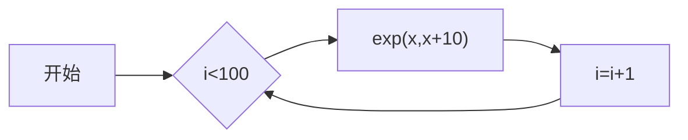
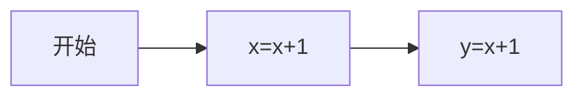
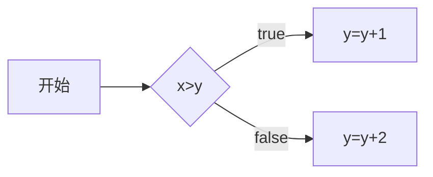
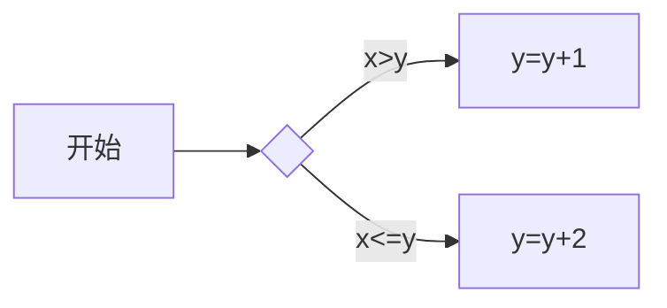
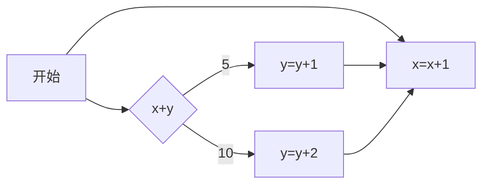

# mermaid-flow

一款基于mermaid的流程控制框架

<!-- PROJECT SHIELDS -->

[![Contributors][contributors-shield]][contributors-url]
[![Forks][forks-shield]][forks-url]
[![Stargazers][stars-shield]][stars-url]
[![Issues][issues-shield]][issues-url]
[![MIT License][license-shield]][license-url]

<!-- PROJECT LOGO -->
<br />

<p align="center">
  <a href="https://gitee.com/orangewest/mermaid-flow">
    
  </a>

<h3 align="center">mermaid-flow</h3>
  <p align="center">
    一款基于mermaid的流程控制框架
    <br />
    <a href="https://gitee.com/orangewest/mermaid-flow"><strong>探索本项目的文档 »</strong></a>
    <br />
    <br />
    <a href="https://gitee.com/orangewest/mermaid-flow/blob/master/mermaid-flow-core/src/test/java/io/github/orangewest/flow/core/FlowFactoryTest.java">查看Demo</a>
    ·
    <a href="https://gitee.com/orangewest/mermaid-flow/issues">报告Bug</a>
    ·
    <a href="https://gitee.com/orangewest/mermaid-flow/issues">提出新特性</a>
  </p>

</p>

## 一、框架说明

mermaid-flow，顾名思义，就是一款基于mermaid设计的流程框架。

[mermaid](https://mermaid.nodejs.cn/intro/)介绍如下：

> **Mermaid 允许你使用文本和代码创建图表和可视化。**
>
> 它是一个基于 JavaScript 的图表绘制工具，可渲染 Markdown 启发的文本定义以动态创建和修改图表。
>

项目中用到的是mermaid流程图语法，当然也没有那么复杂，只用到部分定义（文本框、菱形框、链接线），程序通过解析绘制的流程图，来根据流程图进行流程控制，所见即所得。

大概实现了以下功能：

1、流程控制（顺序流程、条件流程、循环流程）

2、流程节点动态更新

3、流程执行日志

4、流程运行数据持久化

。。。

## 二、框架使用

### 1、基本使用

定义的流程图flow1.md如下：


流程图代码如下：
```plain

flowchart LR
    start[开始]
    10000{i<100}
    11000["exp(x,x+10)"]
    12000["i=i+1"]
    start --> 10000 --> 11000 --> 12000
    12000 --> 10000

```

该流程图主要功能就是循环增加x的值。

其中，流程图中必须仅有一个start节点，作为流程起始节点。

exp(x,x+10) 是系统内置的一个函数，就是把x+10的值赋值给x

当然我们也可以用简写形式，比如i=i+1

使用代码如下

```java
    @Test
    void testFlow1(){
        // 创建一个流程工厂实例
        FlowFactory flowFactory=new FlowFactory();
        // 设置流程图解析器，使用Mermaid文件格式的流程图
        flowFactory.setFlowchartParser(new MermaidFileParser(getFilePath("flow1.md")));
        // 定义一个整型变量键，用于流程中变量的访问
        VariableKey<Integer> x=VariableKey.of("x",Integer.class);
        // 初始化全局流程变量x为0
        flowFactory.initVariable(x,0);
        // 获取或创建一个名为"flow"的流程实例
        Flow flow=flowFactory.getOrCreateFlow("flow");
        // 获取流程的上下文，用于存储和访问流程执行过程中的变量
        FlowContext flowContext=flow.getFlowContext();
        // 循环10次，每次执行流程，并验证流程的执行结果
        for(int j=1;j<=10;j++){
        // 定义一个局部变量键i，用于循环中的临时变量
        VariableKey<Integer> i=VariableKey.of("i",Integer.class);
        // 在流程上下文中设置局部变量i为0
        flowContext.putLocal(i,0);
        // 启动流程执行
        flow.start();
        // 验证流程执行次数是否与预期相符
        Assertions.assertEquals(j,flowContext.getCount());
        // 验证流程中变量x的值是否与预期相符
        Assertions.assertEquals(j*1000,flowContext.get(x));
        }
    }

```

流程图里面的变量分为局部变量和全局变量。

局部变量：执行完一次流程就会清空。

全局变量：执行销毁流程的方法就会清空。

### 2、顺序流程

定义的流程图flow2.md如下：


流程图代码如下：
```plain

flowchart LR
    start[开始]
    10000["x=x+1"]
    11000["y=x+1"]
    start --> 10000 --> 11000

```

使用代码：

```java
    @Test
    void testFlow2(){
        FlowFactory flowFactory=new FlowFactory();
        flowFactory.setFlowchartParser(new MermaidFileParser(getFilePath("flow2.md")));
        VariableKey<Integer> x=VariableKey.of("x",Integer.class);
        VariableKey<Integer> y=VariableKey.of("y",Integer.class);
        flowFactory.initVariable(x,0);
        flowFactory.initVariable(y,0);
        Flow flow=flowFactory.getOrCreateFlow("flow");
        flow.start();
        FlowContext flowContext=flow.getFlowContext();
        Assertions.assertEquals(1,flowContext.get(x));
        Assertions.assertEquals(2,flowContext.get(y));
    }

```

### 3、条件控制

定义的流程图flow3.md如下：


```plain

flowchart LR
    start[开始]
    10000{x>y}
    11000[y=y+1]
    12000[y=y+2]
    start --> 10000 -- true --> 11000
    10000 -- false --> 12000

```

```java
    @Test
    void testFlow3(){
        FlowFactory flowFactory=new FlowFactory();
        flowFactory.setFlowchartParser(new MermaidFileParser(getFilePath("flow3.md")));
        VariableKey<Integer> x=VariableKey.of("x",Integer.class);
        VariableKey<Integer> y=VariableKey.of("y",Integer.class);
        flowFactory.initVariable(x,5);
        flowFactory.initVariable(y,0);
        Flow flow=flowFactory.getOrCreateFlow("flow");
        FlowContext flowContext=flow.getFlowContext();
        for(int i=0;i< 10;i++){
            System.out.println("x:"+flowContext.get(x)+" y:"+flowContext.get(y));
            flow.start();
        }
    }

```

start-->10000--true-->11000 等同于 start-->10000-->11000

执行结果如下：

```plain
x:5 y:0
flowId:flow execute time:27
flowId:flow execute count:1 context:start==>10000==>11000
x:5 y:1
flowId:flow execute time:0
flowId:flow execute count:2 context:start==>10000==>11000
x:5 y:2
flowId:flow execute time:0
flowId:flow execute count:3 context:start==>10000==>11000
x:5 y:3
flowId:flow execute time:2
flowId:flow execute count:4 context:start==>10000==>11000
x:5 y:4
flowId:flow execute time:0
flowId:flow execute count:5 context:start==>10000==>11000
x:5 y:5
flowId:flow execute time:0
flowId:flow execute count:6 context:start==>10000==>12000
x:5 y:7
flowId:flow execute time:1
flowId:flow execute count:7 context:start==>10000==>12000
x:5 y:9
flowId:flow execute time:0
flowId:flow execute count:8 context:start==>10000==>12000
x:5 y:11
flowId:flow execute time:0
flowId:flow execute count:9 context:start==>10000==>12000
x:5 y:13
flowId:flow execute time:0
flowId:flow execute count:10 context:start==>10000==>12000
```

当然也可以这样使用，在流程连接上直接定义执行条件



```plain

flowchart LR
    start[开始]
    10000{ }
    11000[y=y+1]
    12000[y=y+2]

    start-->10000--"x>y"-->11000
    10000--"x<=y"-->12000

```

```java
    @Test
    void testFlow4(){
        FlowFactory flowFactory=new FlowFactory();
        flowFactory.setFlowchartParser(new MermaidFileParser(getFilePath("flow4.md")));
        VariableKey<Integer> x=VariableKey.of("x",Integer.class);
        VariableKey<Integer> y=VariableKey.of("y",Integer.class);
        flowFactory.initVariable(x,5);
        flowFactory.initVariable(y,0);
        Flow flow=flowFactory.getOrCreateFlow("flow");
        FlowContext flowContext=flow.getFlowContext();
        for(int i=0;i< 10;i++){
            System.out.println("x:"+flowContext.get(x)+" y:"+flowContext.get(y));
            flow.start();
        }
    }
```

或者这样使用


```plain

flowchart LR
    start[开始]
    10000{x+y}
    11000[y=y+1]
    12000[y=y+2]
    13000[x=x+1]
    start-->13000
    start-->10000--5-->11000-->13000
    10000--10-->12000-->13000

```

```java
    @Test
    void testFlow5(){
        FlowFactory flowFactory=new FlowFactory();
        flowFactory.setFlowchartParser(new MermaidFileParser(getFilePath("flow5.md")));
        VariableKey<Integer> x=VariableKey.of("x",Integer.class);
        VariableKey<Integer> y=VariableKey.of("y",Integer.class);
        flowFactory.initVariable(x,1);
        flowFactory.initVariable(y,0);
        Flow flow=flowFactory.getOrCreateFlow("flow");
        FlowContext flowContext=flow.getFlowContext();
        for(int i=0;i< 10;i++){
            System.out.println("x:"+flowContext.get(x)+" y:"+flowContext.get(y));
            flow.start();
        }
    }
```

条件里面比较等值

### 4、流程更新

我们可以动态更新流程节点，以上面的流程flow4.md为例

```java
    @Test
    void testFlow4Update(){
        FlowFactory flowFactory=new FlowFactory();
        flowFactory.setFlowchartParser(new MermaidFileParser(getFilePath("flow4.md")));
        VariableKey<Integer> x=VariableKey.of("x",Integer.class);
        VariableKey<Integer> y=VariableKey.of("y",Integer.class);
        flowFactory.initVariable(x,5);
        flowFactory.initVariable(y,0);
        Flow flow=flowFactory.getOrCreateFlow("flow");
        FlowContext flowContext=flow.getFlowContext();
        for(int i=0;i< 10;i++){
            if(i==6){
                flow.updateNodeContent("12000","x=x+5");
            }
            if(i==8){
                flow.updateNodeLink("10000","12000","y>5");
            }
            System.out.println("x:"+flowContext.get(x)+" y:"+flowContext.get(y));
            flow.start();
        }
    }
```

执行结果如下：

```plain
x:5 y:0
flowId:flow execute time:20
flowId:flow execute count:1 context:start==>10000==>11000
x:5 y:1
flowId:flow execute time:0
flowId:flow execute count:2 context:start==>10000==>11000
x:5 y:2
flowId:flow execute time:0
flowId:flow execute count:3 context:start==>10000==>11000
x:5 y:3
flowId:flow execute time:0
flowId:flow execute count:4 context:start==>10000==>11000
x:5 y:4
flowId:flow execute time:0
flowId:flow execute count:5 context:start==>10000==>11000
x:5 y:5
flowId:flow execute time:1
flowId:flow execute count:6 context:start==>10000==>12000
x:5 y:7
flowId:flow execute time:0
flowId:flow execute count:7 context:start==>10000==>12000
x:10 y:7
flowId:flow execute time:1
flowId:flow execute count:8 context:start==>10000==>11000
x:10 y:8
flowId:flow execute time:0
flowId:flow execute count:9 context:start==>10000==>11000==>12000
x:15 y:9
flowId:flow execute time:0
flowId:flow execute count:10 context:start==>10000==>11000==>12000
```

### 5、流程拓展

#### 5.1、监控流程执行情况

实现FlowAspect 、FlowNodeAspect 这2个接口，这里面分别对流程和单个流程节点执行进行监控。

比如，实现一个对当前执行顺序监控

```java
public class FlowExecAop implements FlowAspect {

    public final static VariableKey<Long> TIME = VariableKey.of("time", Long.class);

    public final static VariableKey<List<String>> EXE_CONTEXT = VariableKey.of("exeContext", new TypeReference<List<String>>() {
    });

    @Override
    public void beforeStart(Flow flow, FlowContext flowContext) {
        flowContext.putLocal(TIME, System.currentTimeMillis());
        flowContext.putLocal(EXE_CONTEXT, new ArrayList<>());
    }

    @Override
    public void afterStart(Flow flow, FlowContext flowContext) {
        long time = System.currentTimeMillis() - flowContext.getFromLocal(TIME);
        System.out.println("flowId:" + flow.getFlowId() + " execute time:" + time);
        List<String> fromLocal = flowContext.getFromLocal(EXE_CONTEXT);
        String collect = String.join("==>", fromLocal);
        System.out.println("flowId:" + flow.getFlowId() + " execute count:" + flowContext.getCount() + " context:" + collect);
    }

}

```

```java
public class FlowNodeExecAop implements FlowNodeAspect {

    @Override
    public void beforeExecute(AbstractFlowNode flowNode, FlowContext flowContext) {

    }

    @Override
    public void afterExecute(AbstractFlowNode flowNode, FlowContext flowContext) {
        List<String> context = flowContext.getFromLocal(FlowExecAop.EXE_CONTEXT);
        context.add(flowNode.getFlowNodeMeta().getNodeId());
    }

}

```

把切面添加进入切面管理类即可

```java
    FlowAspectManager.addFlowNodeAspect(new FlowNodeExecAop());
    FlowAspectManager.addFlowAspect(new FlowExecAop());
```

#### 5.2、自定义函数

有一些节点可能需要实现复杂的业务逻辑，这个时候可以通过自定义函数实现

接口实现OptFunction即可

```java
public interface OptFunction {

    /**
     * 获取操作函数的名称。
     *
     * @return 操作函数的名称。
     */
    String getName();

    /**
     * 执行操作函数。
     *
     * @param params 执行函数所需的参数数组。
     * @param flowContext 流程上下文，包含执行环境的相关信息。
     * @return 执行结果，true表示执行成功，false表示执行失败。执行失败后，将不会进入下一个节点。
     */
    boolean execute(String[] params, FlowContext flowContext);
}

```

进行函数注册：

```java
    OptFunctionFactory.register();
```

<!-- links -->

[your-project-path]:orangewest/mermaid-flow

[contributors-shield]: https://img.shields.io/github/contributors/orangewest/mermaid-flow.svg?style=flat-square

[contributors-url]: https://gitee.com/orangewest/mermaid-flow/graphs/contributors

[forks-shield]: https://img.shields.io/github/forks/orangewest/mermaid-flow.svg?style=flat-square

[forks-url]: https://gitee.com/orangewest/mermaid-flow/network/members

[stars-shield]: https://img.shields.io/github/stars/orangewest/mermaid-flow.svg?style=flat-square

[stars-url]: https://gitee.com/orangewest/mermaid-flow/stargazers

[issues-shield]: https://img.shields.io/github/issues/orangewest/mermaid-flow.svg?style=flat-square

[issues-url]: https://img.shields.io/github/issues/orangewest/mermaid-flow.svg

[license-shield]: https://img.shields.io/github/license/orangewest/mermaid-flow.svg?style=flat-square

[license-url]: https://gitee.com/orangewest/mermaid-flow/blob/master/LICENSE.txt


